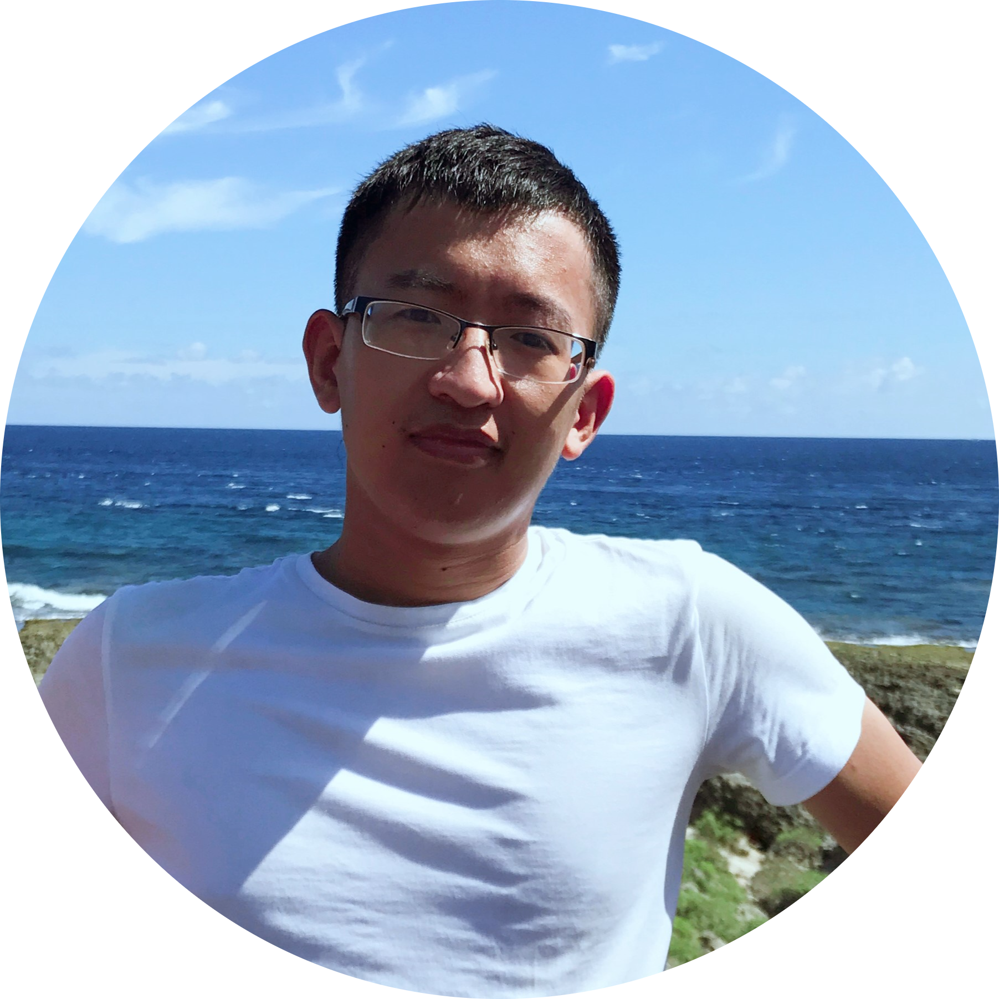

  

# Huiping Lin
 [linhuiping15@gmail.com](mailto:linhuiping15@gmail.com)  
 [GitHub](https://github.com/HuipingLinn)  
 [Chongqing, China](https://www.google.com/maps/place/%E9%87%8D%E5%BA%86%E5%A4%A7%E5%AD%A6/@29.5578613,106.4242113,14z/data=!4m6!3m5!1s0x36eccb948120ecb1:0xbcacf824c7bdf803!8m2!3d29.56488!4d106.468097!16zL20vMDJreTdn?entry=ttu&g_ep=EgoyMDI1MTAwNi4wIKXMDSoASAFQAw%3D%3D)  

---

##  Contact Address

**Affiliation:** School of Microelectronics and Communication Engineering, Chongqing University  
**Address:** No. 174, Shazheng Street, Shapingba District, Chongqing, China  
**Portfolio:** [https://huipinglinn.github.io](https://huipinglinn.github.io)

---

##  Research Interests

SAR image understanding and interpretation, polarimetric SAR target detection and recognition, polarimetry, machine learning and computer vision.

---

##  Education

**Tsinghua University** — *Beijing, China*  
- **B.E.** in Electronic Engineering *(Aug 2011 – Jul 2015)*  
- **Ph.D.** in Information and Communication Engineering *(Aug 2015 – Jun 2020)*

---

##  Experience

### **Chongqing University** — Professor  
 *Chongqing, China | Dec 2024 – Present (Full-time)*  
- Engaged in the field of polarimetric SAR image understanding and interpretation, focusing on polarimetric SAR target detection and recognition.  
- Combined SAR imaging geometry, target electromagnetic scattering processes, and deep learning techniques represented by neural networks.  
- Proposed a series of polarimetric SAR filtering methods and target recognition approaches based on polarimetric scattering mechanisms, improving SAR image intelligence collection efficiency.

### **Fudan University** — Assistant Researcher  
 *Shanghai, China | Jul 2022 – Nov 2024 (Full-time)*  
- Worked on the **“Intelligent Target Recognition in Polarimetric SAR Images”** project at the Key Laboratory for Information Science of Electromagnetic Waves (MoE).

---
<!-- **H. Lin**, X. Su, Z. Zeng, C. Xing, and J. Yin, “Speckle2self: Learning self-supervised despeckling with attention mechanism for SAR images,” *Remote Sensing*, vol. 17, no. 23, p. 3840, 2025 -->
##  Publications
####  *Journal Articles*
1. <b><ins>H. Lin</ins></b>, J. Yin, and J. Yang, “Learning quaternion convolutional neural networks for PolSAR target recognition,” *IEEE Transactions on Aerospace and Electronic Systems*, 2025

2. <b><ins>H. Lin</ins></b>, X. Su, Z. Zeng, C. Xing, and J. Yin, “Speckle2self: Learning self-supervised despeckling with attention mechanism for SAR images,” *Remote Sensing*, vol. 17, no. 23, p. 3840, 2025

3. Z. Zeng, Z. Chen, J. Yin, and <b><ins>H. Lin\*</ins></b>, “Ship detection in SAR images using sparse R-CNN with wavelet deformable convolution and attention mechanism,” *Remote Sensing*, vol. 17, no. 23, p. 3794, 2025

4.  <b><ins>H. Lin</ins></b>, Z. Xie, L. Zeng, and J. Yin, "Multi-scale time-frequency representation fusion network for target recognition in SAR imagery," *Remote Sensing*, vol. 17, no. 16, p. 2786, 2025.

5.  <b><ins>H. Lin</ins></b>, J. Yin, J. Yang, and F. Xu, "Interpreting neural network pattern with pruning for PolSAR target recognition," *IEEE Transactions on Geoscience and Remote Sensing*, 2024.

6.  Y. Wang, H. Jia, S. Fu, H., <b><ins>H. Lin*</ins></b>, and F. Xu, "Reinforcement learning for SAR target orientation inference with the differentiable SAR renderer," *IEEE Transactions on Geoscience and Remote Sensing*, vol. 62, pp. 1–13, 2024.

7.  <b><ins>H. Lin</ins></b>, J. Yang, and F. Xu, "PolSAR target recognition with CNNs optimizing discrete polarimetric correlation pattern," *IEEE Transactions on Geoscience and Remote Sensing*, vol. 62, pp. 1–14, 2024.

8.  <b><ins>H. Lin</ins></b>, H. Wang, J. Yin, and J. Yang, "Local climate zone classification via semi-supervised multimodal multiscale transformer," *IEEE Transactions on Geoscience and Remote Sensing*, vol. 62, pp. 1–17, 2024.

9.  <b><ins>H. Lin</ins></b>, H. Wang, F. Xu, and Y.-Q. Jin, "Target recognition for SAR images enhanced by polarimetric information," *IEEE Transactions on Geoscience and Remote Sensing*, vol. 62, pp. 1–16, 2024.

10.  <b><ins>H. Lin</ins></b>, K. Jin, J. Yin, J. Yang, T. Zhang, F. Xu, and Y.-Q. Jin, "Residual in residual scaling networks for polarimetric SAR image despeckling," *IEEE Transactions on Geoscience and Remote Sensing*, vol. 61, pp. 1–17, 2023.

11.  <b><ins>H. Lin</ins></b>, H. Wang, J. Wang, J. Yin, and J. Yang, "A novel ship detection method via generalized polarization relative entropy for PolSAR images," *IEEE Geoscience and Remote Sensing Letters*, vol. 19, pp. 1–5, 2020.

12.  <b><ins>H. Lin</ins></b>, F. Yuan, C. Xing, and J. Yang, "An edge attention-based geodesic distance for PolSAR image superpixel segmentation," *Electronics Letters*, vol. 56, no. 10, pp. 510–512, 2020.

13. <b><ins>H. Lin</ins></b>, H. Chen, K. Jin, L. Zeng, and J. Yang, "Ship detection with superpixel-level Fisher vector in high-resolution SAR images," *IEEE Geoscience and Remote Sensing Letters*, vol. 17, no. 2, pp. 247–251, 2019.

14. <b><ins>H. Lin</ins></b>, H. Chen, H. Wang, J. Yin, and J. Yang, "Ship detection for PolSAR images via task-driven discriminative dictionary learning," *Remote Sensing*, vol. 11, no. 7, p. 769, 2019.

15. <b><ins>H. Lin</ins></b>, S. Song, and J. Yang, "Ship classification based on MSHOG feature and task-driven dictionary learning with structured incoherent constraints in SAR images," *Remote Sensing*, vol. 10, no. 2, p. 190, 2018.

16. Y. Xing, <b><ins>H. Lin</ins></b>, F. Wang, F. Xue, and F. Xu, "SAR2Canopy: A framework integrating scattering model with neural networks for canopy height estimation from airborne p-band SAR data," *IEEE Transactions on Geoscience and Remote Sensing*, 2025.

17. R. Li, J. Wei, H., <b><ins>H. Lin</ins></b> and F. Xu, "Learning terrain scattering models from massive multi-source earth observation data," *IEEE Transactions on Geoscience and Remote Sensing*, 2025.

18. L. Zeng, Y. Du, <b><ins>H. Lin</ins></b>, J. Wang, J. Yin, and J. Yang, "A novel region-based image registration method for multisource remote sensing images via CNN," *IEEE Journal of Selected Topics in Applied Earth Observations and Remote Sensing*, vol. 14, pp. 1821–1831, 2020.

####   *Conference Papers*
   
1. <b><ins>H. Lin</ins></b>, J. Yin, and J. Yang, "Revisiting the Contribution of Polarimetric Information to Target Recognition for SAR Images," in *IGARSS 2025 - 2025 IEEE International Geoscience and Remote Sensing Symposium*, Brisbane, Australia, 2025, pp. 9122–9125.

2. Z. Xie, <b><ins>H. Lin*</ins></b>, and F. Xu, "SAR Target Recognition Network Based on Time-Frequency Domain Channel Attention Mechanism," in *2024 IEEE International Conference on Signal, Information and Data Processing (ICSIDP)*, Zhuhai, China, 2024, pp. 1–6.

3. Z. Chen, <b><ins>H. Lin*</ins></b>, and F. Xu, "A Wavelet Feature Based SAR Ship Detection Algorithm in Sparse Framework," in *2024 IEEE International Conference on Signal, Information and Data Processing (ICSIDP)*, Zhuhai, China, 2024, pp. 1–4.

4. <b><ins>H. Lin</ins></b>, Y. Xing, Z. Chen, J. Yin, and J. Yang, "Edge Attention Superpixel Segmentation for Polarimetric SAR Images," in *IGARSS 2024 - 2024 IEEE International Geoscience and Remote Sensing Symposium*, Athens, Greece, 2024, pp. 9770–9773.

5. <b><ins>H. Lin</ins></b> and H. Wang, "A Novel Target Recognition Method with Polarimetric Correlation Phase for SAR Images," in *IET Conference Proceedings CP874*, vol. 2023, no. 47, 2023, pp. 1152–1156.

6. <b><ins>H. Lin</ins></b>, J. Yin, H. Wang, and J. Yang, "Edge Detection in PolSAR Images Based on Polarimetric Nonsubsampled Contourlet Transform," in *IET Conference Proceedings CP874*, vol. 2023, no. 47, 2023, pp. 2817–2820.

7. <b><ins>H. Lin</ins></b>, H. Wang, H. Chen, J. Yin, and J. Yang, "Ship Detection for Polarimetric SAR Images Via Graph-Based Sparse Manifold Ranking," in *IGARSS 2019 - 2019 IEEE International Geoscience and Remote Sensing Symposium*, Yokohama, Japan, 2019, pp. 2193–2196.

8. <b><ins>H. Lin</ins></b>, J. Bao, J. Yin, and J. Yang, "Superpixel Segmentation with Boundary Constraints for Polarimetric SAR Images," in *IGARSS 2018 - 2018 IEEE International Geoscience and Remote Sensing Symposium*, Valencia, Spain, 2018, pp. 6195–6198.

9. Y. Xing, <b><ins>H. Lin</ins></b>, J. Zhu, F. Wang, F. Xu, and W. Jiang, "Multisource Data Integration of Sentinel-1 and Sentinel-2 for Above Ground Biomass Inversion," in *2024 IEEE International Conference on Signal, Information and Data Processing (ICSIDP)*, Zhuhai, China, 2024, pp. 1–4.

10. Y. Xing, <b><ins>H. Lin</ins></b>, F. Xue, F. Wang, and F. Xu, "A Forest Parameter Inversion Method Based on Double-Bounce Scattering Components of Polarimetric P-Band SAR Data," in *IGARSS 2024 - 2024 IEEE International Geoscience and Remote Sensing Symposium*, Athens, Greece, 2024, pp. 3599–3603.

11. Y. Wang, H. Jia, S. Fu, <b><ins>H. Lin</ins></b>, and F. Xu, "Differentiable SAR Renderer Embedded Reinforcement Learning for View Angles Inversion in SAR Images," in *IGARSS 2024 - 2024 IEEE International Geoscience and Remote Sensing Symposium*, Athens, Greece, 2024, pp. 1992–1995.

12. R. Li, <b><ins>H. Lin</ins></b>, J. Wei, and F. Xu, "Utilizing Multisource Data: Inversion of Surface Texture Parameters and Generation of Multi-Angle SAR Images Through Physical Models," in *IGARSS 2024 - 2024 IEEE International Geoscience and Remote Sensing Symposium*, Athens, Greece, 2024, pp. 3058–3061.

---

##  Awards & Achievements

- Young Scientists of the 5th National Radar Earth Observation Conference, 2025  
- Outstanding Postdoctoral Fellows of Fudan University, 2024
- Shanghai Super Postdoctoral Incentive Program, 2022  

---

##  Skills

**Programming Languages:** C/C++, Python, MATLAB  
**Technologies:** Qt, MySQL, Git, Docker, OpenCV, PyTorch, TensorFlow  

---

  

---
*Last updated: October 2025*
